# 🐳 Guia Completo de Deploy com Docker - CSV Q&A Agent

## 📋 Índice
1. [Visão Geral](#-visão-geral)
2. [Pré-requisitos](#-pré-requisitos)
3. [Setup Básico](#-setup-básico)
4. [Configuração Avançada](#️-configuração-avançada)
5. [Deploy em Produção](#-deploy-em-produção)
6. [Monitoramento](#-monitoramento)
7. [Troubleshooting](#-troubleshooting)
8. [Otimização](#-otimização)

---

## 🎯 Visão Geral

Este guia fornece instruções completas para fazer o deploy do CSV Q&A Agent usando Docker, desde um setup local básico até um ambiente de produção robusto.

### 🏗️ Arquitetura Docker

```mermaid
graph TB
    A[🌐 Load Balancer] --> B[🐳 CSV-QA Container 1]
    A --> C[🐳 CSV-QA Container 2] 
    A --> D[🐳 CSV-QA Container N]
    
    B --> E[📁 Shared Volume /data]
    C --> E
    D --> E
    
    B --> F[📊 Logs Volume /logs]
    C --> F
    D --> F
    
    G[🔧 Environment Variables] --> B
    G --> C
    G --> D
```



---

## 🔧 Pré-requisitos

### 💻 Sistema Host
- **Docker Engine**: 20.10+ (recomendado 24.0+)
- **Docker Compose**: 2.0+ (incluído no Docker Desktop)
- **RAM**: Mínimo 4GB, recomendado 8GB+
- **Disco**: Mínimo 10GB livres
- **CPU**: 2+ cores recomendado

### 🔑 Credenciais (Opcional)
- **OpenAI API Key**: Para funcionalidades LLM avançadas
- **Outras APIs**: Conforme necessidade futura

### 🌐 Rede
- **Porta 8501**: Disponível para Streamlit
- **Internet**: Para download de dependências e APIs

---

## 🚀 Setup Básico

### 1️⃣ Clone e Preparação

```bash
# Clone o repositório
git clone https://github.com/seu-usuario/CSV_QA_Agent.git
cd CSV_QA_Agent

# Verifique a estrutura
ls -la
```

### 2️⃣ Configuração de Ambiente

```bash
# Copie o template de environment
cp .env.example .env

# Edite com suas configurações
nano .env
```

**Conteúdo do `.env`:**
```bash
# === CONFIGURAÇÕES ESSENCIAIS ===
OPENAI_API_KEY=sk-sua-chave-aqui
LOG_LEVEL=INFO
PYTHONUNBUFFERED=1

# === CONFIGURAÇÕES STREAMLIT ===
STREAMLIT_SERVER_PORT=8501
STREAMLIT_SERVER_ADDRESS=0.0.0.0
STREAMLIT_SERVER_HEADLESS=true

# === CONFIGURAÇÕES APLICAÇÃO ===
MAX_FILE_SIZE_MB=200
EXECUTION_TIMEOUT=30
ENABLE_LLM_INSIGHTS=true
DEFAULT_LANGUAGE=pt-BR

# === CONFIGURAÇÕES AVANÇADAS ===
CACHE_RESPONSES=true
VALIDATE_CODE_STRICT=true
SANDBOX_MODE=true
```

### 3️⃣ Build e Execução Simples

```bash
# Build da imagem
docker-compose build

# Execução em foreground (para debug)
docker-compose up

# Execução em background
docker-compose up -d
```

### 4️⃣ Verificação

```bash
# Verificar containers rodando
docker-compose ps

# Verificar logs
docker-compose logs -f

# Testar aplicação
curl http://localhost:8501
```

---

## ⚙️ Configuração Avançada

### 🔧 Docker Compose Customizado

**`docker-compose.override.yml`** (para desenvolvimento):
```yaml
services:
  csv-qa-agent:
    volumes:
      # Mount código para desenvolvimento
      - .:/app
      # Persist data local
      - ./dev-data:/app/data
      - ./dev-logs:/app/logs
    environment:
      - LOG_LEVEL=DEBUG
      - STREAMLIT_SERVER_RUNONSAVE=true
    ports:
      - "8501:8501"
      - "8502:8502"  # Porta extra para debug
```

**`docker-compose.prod.yml`** (para produção):
```yaml
services:
  csv-qa-agent:
    build:
      context: .
      dockerfile: Dockerfile.prod
    restart: unless-stopped
    deploy:
      resources:
        limits:
          cpus: '2.0'
          memory: 4G
        reservations:
          cpus: '1.0'
          memory: 2G
    healthcheck:
      test: ["CMD", "curl", "-f", "http://localhost:8501/_stcore/health"]
      interval: 30s
      timeout: 10s
      retries: 3
      start_period: 60s
    volumes:
      - app-data:/app/data
      - app-logs:/app/logs
    environment:
      - STREAMLIT_SERVER_ENABLECORS=false
      - STREAMLIT_SERVER_ENABLEXSRFPROTECTION=true

volumes:
  app-data:
    driver: local
  app-logs:
    driver: local
```

### 🛡️ Dockerfile Otimizado para Produção

**`Dockerfile.prod`:**
```dockerfile
# Build stage
FROM python:3.11-slim as builder

WORKDIR /app

# Install build dependencies
RUN apt-get update && apt-get install -y \
    gcc \
    g++ \
    && rm -rf /var/lib/apt/lists/*

# Copy requirements and install dependencies
COPY requirements.txt .
RUN pip wheel --no-cache-dir --no-deps --wheel-dir /app/wheels -r requirements.txt

# Production stage
FROM python:3.11-slim

WORKDIR /app

# Create non-root user
RUN groupadd -r appuser && useradd -r -g appuser appuser

# Install only runtime dependencies
RUN apt-get update && apt-get install -y \
    curl \
    && rm -rf /var/lib/apt/lists/*

# Copy wheels and install
COPY --from=builder /app/wheels /wheels
COPY requirements.txt .
RUN pip install --no-cache /wheels/*

# Copy application code
COPY --chown=appuser:appuser . .

# Create necessary directories
RUN mkdir -p /app/data /app/logs && \
    chown -R appuser:appuser /app

# Switch to non-root user
USER appuser

# Health check
HEALTHCHECK --interval=30s --timeout=10s --start-period=60s --retries=3 \
    CMD curl -f http://localhost:8501/_stcore/health || exit 1

# Expose port
EXPOSE 8501

# Start application
CMD ["streamlit", "run", "app.py", \
     "--server.port=8501", \
     "--server.address=0.0.0.0", \
     "--server.headless=true", \
     "--server.enableCORS=false"]
```

### 🔗 Networking Avançado

**`docker-compose.network.yml`:**
```yaml
networks:
  csvqa-network:
    driver: bridge
    ipam:
      config:
        - subnet: 172.20.0.0/16

services:
  csv-qa-agent:
    networks:
      csvqa-network:
        ipv4_address: 172.20.0.10
  
  # Redis para cache (futuro)
  redis:
    image: redis:7-alpine
    networks:
      csvqa-network:
        ipv4_address: 172.20.0.20
    volumes:
      - redis-data:/data
  
  # Nginx para load balancing
  nginx:
    image: nginx:alpine
    ports:
      - "80:80"
      - "443:443"
    networks:
      csvqa-network:
        ipv4_address: 172.20.0.5
    volumes:
      - ./nginx.conf:/etc/nginx/nginx.conf
      - ./ssl:/etc/nginx/ssl

volumes:
  redis-data:
```

---

## 🏢 Deploy em Produção

### 🎯 Cenários de Deploy

#### 📦 **Cenário 1: VPS Simples**
```bash
# Deploy em um VPS Ubuntu/CentOS
cd /opt/csvqa
git pull origin main

# Build e deploy
docker-compose -f docker-compose.yml -f docker-compose.prod.yml up -d --build

# Setup backup automático
crontab -e
# 0 2 * * * docker-compose exec csv-qa-agent python backup_data.py
```

#### ☁️ **Cenário 2: AWS ECS**
```yaml
# task-definition.json
{
  "family": "csvqa-task",
  "networkMode": "awsvpc",
  "requiresCompatibilities": ["FARGATE"],
  "cpu": "1024",
  "memory": "2048",
  "executionRoleArn": "arn:aws:iam::ACCOUNT:role/ecsTaskExecutionRole",
  "containerDefinitions": [
    {
      "name": "csvqa-container",
      "image": "seu-registry/csvqa:latest",
      "portMappings": [
        {
          "containerPort": 8501,
          "protocol": "tcp"
        }
      ],
      "environment": [
        {
          "name": "OPENAI_API_KEY",
          "valueFrom": "arn:aws:ssm:region:account:parameter/csvqa/openai-key"
        }
      ],
      "logConfiguration": {
        "logDriver": "awslogs",
        "options": {
          "awslogs-group": "/ecs/csvqa",
          "awslogs-region": "us-east-1",
          "awslogs-stream-prefix": "ecs"
        }
      }
    }
  ]
}
```

#### 🚢 **Cenário 3: Kubernetes**
```yaml
# k8s-deployment.yaml
apiVersion: apps/v1
kind: Deployment
metadata:
  name: csvqa-deployment
spec:
  replicas: 3
  selector:
    matchLabels:
      app: csvqa
  template:
    metadata:
      labels:
        app: csvqa
    spec:
      containers:
      - name: csvqa
        image: csvqa:latest
        ports:
        - containerPort: 8501
        env:
        - name: OPENAI_API_KEY
          valueFrom:
            secretKeyRef:
              name: csvqa-secrets
              key: openai-api-key
        resources:
          requests:
            memory: "1Gi"
            cpu: "500m"
          limits:
            memory: "2Gi"
            cpu: "1000m"
        livenessProbe:
          httpGet:
            path: /_stcore/health
            port: 8501
          initialDelaySeconds: 60
          periodSeconds: 30
        readinessProbe:
          httpGet:
            path: /_stcore/health
            port: 8501
          initialDelaySeconds: 5
          periodSeconds: 10
---
apiVersion: v1
kind: Service
metadata:
  name: csvqa-service
spec:
  selector:
    app: csvqa
  ports:
  - protocol: TCP
    port: 80
    targetPort: 8501
  type: LoadBalancer
```

### 🔒 Configuração SSL/TLS

**`nginx.conf`:**
```nginx
upstream csvqa_backend {
    server csv-qa-agent:8501;
}

server {
    listen 80;
    server_name seu-dominio.com;
    return 301 https://$server_name$request_uri;
}

server {
    listen 443 ssl http2;
    server_name seu-dominio.com;
    
    ssl_certificate /etc/nginx/ssl/cert.pem;
    ssl_certificate_key /etc/nginx/ssl/key.pem;
    ssl_protocols TLSv1.2 TLSv1.3;
    ssl_ciphers ECDHE-RSA-AES256-GCM-SHA512:DHE-RSA-AES256-GCM-SHA512;
    
    location / {
        proxy_pass http://csvqa_backend;
        proxy_set_header Host $host;
        proxy_set_header X-Real-IP $remote_addr;
        proxy_set_header X-Forwarded-For $proxy_add_x_forwarded_for;
        proxy_set_header X-Forwarded-Proto $scheme;
        
        # WebSocket support
        proxy_http_version 1.1;
        proxy_set_header Upgrade $http_upgrade;
        proxy_set_header Connection "upgrade";
    }
    
    # Rate limiting
    limit_req_zone $binary_remote_addr zone=api:10m rate=10r/s;
    limit_req zone=api burst=20 nodelay;
}
```

---

## 📊 Monitoramento

### 📈 Métricas com Docker Stats

```bash
# Script de monitoramento
#!/bin/bash
# monitor.sh

echo "=== CSV Q&A Agent - Monitoring ==="
echo "Timestamp: $(date)"
echo ""

# Container status
echo "📦 Container Status:"
docker-compose ps

echo ""
echo "📊 Resource Usage:"
docker stats csv-qa-agent --no-stream

echo ""
echo "📋 Recent Logs (last 10 lines):"
docker-compose logs --tail=10 csv-qa-agent

echo ""
echo "🌐 Health Check:"
curl -s -o /dev/null -w "HTTP Status: %{http_code}\nResponse Time: %{time_total}s\n" \
    http://localhost:8501/_stcore/health
```

### 📊 Métricas Avançadas com Prometheus

**`docker-compose.monitoring.yml`:**
```yaml
services:
  prometheus:
    image: prom/prometheus:latest
    ports:
      - "9090:9090"
    volumes:
      - ./prometheus.yml:/etc/prometheus/prometheus.yml
      - prometheus-data:/prometheus
    command:
      - '--config.file=/etc/prometheus/prometheus.yml'
      - '--storage.tsdb.path=/prometheus'
      - '--web.console.libraries=/etc/prometheus/console_libraries'
      - '--web.console.templates=/etc/prometheus/consoles'

  grafana:
    image: grafana/grafana:latest
    ports:
      - "3000:3000"
    volumes:
      - grafana-data:/var/lib/grafana
    environment:
      - GF_SECURITY_ADMIN_PASSWORD=admin123

  cadvisor:
    image: gcr.io/cadvisor/cadvisor:latest
    ports:
      - "8080:8080"
    volumes:
      - /:/rootfs:ro
      - /var/run:/var/run:rw
      - /sys:/sys:ro
      - /var/lib/docker:/var/lib/docker:ro

volumes:
  prometheus-data:
  grafana-data:
```

### 📊 Dashboard Grafana Customizado

```json
{
  "dashboard": {
    "title": "CSV Q&A Agent Monitoring",
    "panels": [
      {
        "title": "Container CPU Usage",
        "type": "graph",
        "targets": [
          {
            "expr": "rate(container_cpu_usage_seconds_total{name=\"csv-qa-agent\"}[5m]) * 100"
          }
        ]
      },
      {
        "title": "Memory Usage",
        "type": "graph", 
        "targets": [
          {
            "expr": "container_memory_usage_bytes{name=\"csv-qa-agent\"} / 1024 / 1024 / 1024"
          }
        ]
      },
      {
        "title": "Request Count",
        "type": "stat",
        "targets": [
          {
            "expr": "sum(increase(http_requests_total[5m]))"
          }
        ]
      }
    ]
  }
}
```

---

## 🚨 Troubleshooting

### 🔍 Diagnóstico Comum

#### **1. Container não inicia**
```bash
# Verificar logs de build
docker-compose build --no-cache

# Verificar logs de startup
docker-compose logs csv-qa-agent

# Verificar configurações
docker-compose config

# Verificar recursos do sistema
docker system df
docker system prune  # Limpar espaço se necessário
```

#### **2. Aplicação inacessível**
```bash
# Verificar se o container está rodando
docker-compose ps

# Verificar porta binding
netstat -tlnp | grep 8501

# Verificar health da aplicação
docker-compose exec csv-qa-agent curl http://localhost:8501/_stcore/health

# Verificar logs de rede
docker network ls
docker network inspect csv_qa_agent_default
```

#### **3. Performance lenta**
```bash
# Verificar recursos
docker stats csv-qa-agent

# Verificar logs de performance
docker-compose logs csv-qa-agent | grep "execution_time"

# Verificar configuração de memória
docker-compose config | grep memory

# Ajustar limites se necessário
# No docker-compose.yml:
deploy:
  resources:
    limits:
      memory: 4G
    reservations:
      memory: 2G
```

#### **4. Erros de API OpenAI**
```bash
# Verificar variável de ambiente
docker-compose exec csv-qa-agent printenv | grep OPENAI

# Testar API key
docker-compose exec csv-qa-agent python -c "
import openai
client = openai.OpenAI()
print(client.models.list())
"

# Verificar logs de LLM
docker-compose logs csv-qa-agent | grep -i openai
```

### 🛠️ Comandos de Debug Úteis

```bash
# === CONTAINER DEBUGGING ===
# Acessar shell do container
docker-compose exec csv-qa-agent bash

# Verificar processos internos
docker-compose exec csv-qa-agent ps aux

# Verificar arquivos de configuração
docker-compose exec csv-qa-agent cat config.py

# === LOGS AVANÇADOS ===
# Logs com timestamp
docker-compose logs -t csv-qa-agent

# Logs de uma janela de tempo
docker-compose logs --since="2024-01-01T12:00:00" csv-qa-agent

# Logs em tempo real com filtro
docker-compose logs -f csv-qa-agent | grep ERROR

# === NETWORKING ===
# Verificar conectividade entre containers
docker-compose exec csv-qa-agent ping redis

# Verificar DNS interno
docker-compose exec csv-qa-agent nslookup csv-qa-agent

# === PERFORMANCE ===
# Profiling de memória
docker-compose exec csv-qa-agent python -m memory_profiler app.py

# Verificar uso de disco
docker-compose exec csv-qa-agent df -h
```

### 📋 Checklist de Troubleshooting

- [ ] **Verificar logs de build** - Erros durante construção da imagem
- [ ] **Verificar variáveis de ambiente** - Configurações corretas
- [ ] **Verificar portas** - Não há conflitos de porta
- [ ] **Verificar recursos** - RAM e CPU suficientes
- [ ] **Verificar rede** - Conectividade entre containers
- [ ] **Verificar volumes** - Montagem correta de dados
- [ ] **Verificar permissões** - Usuário tem acesso aos arquivos
- [ ] **Verificar health checks** - Aplicação responde corretamente

---

## ⚡ Otimização

### 🚀 Performance Docker

#### **1. Build Optimization**
```dockerfile
# Use multi-stage builds
FROM python:3.11-slim as base
FROM base as deps
FROM base as production

# Use .dockerignore efetivo
echo "
**/.git
**/node_modules
**/venv
**/__pycache__
**/logs
**/data
" > .dockerignore

# Cache layers de dependências
COPY requirements.txt .
RUN pip install -r requirements.txt
# Só depois copiar código (que muda mais)
COPY . .
```

#### **2. Runtime Optimization**
```yaml
# docker-compose.yml otimizado
services:
  csv-qa-agent:
    # Limitar recursos
    deploy:
      resources:
        limits:
          cpus: '2.0'
          memory: 4G
        reservations:
          cpus: '1.0'
          memory: 2G
    
    # Configurar restart policy
    restart: unless-stopped
    
    # Usar init para reaping de processos
    init: true
    
    # Configurar logging otimizado
    logging:
      driver: "json-file"
      options:
        max-size: "100m"
        max-file: "3"
```

#### **3. Caching Strategy**
```bash
# Build com BuildKit para cache avançado
DOCKER_BUILDKIT=1 docker-compose build

# Cache de layers entre builds
docker-compose build --build-arg BUILDKIT_INLINE_CACHE=1

# Registry cache (para CI/CD)
docker buildx build --cache-from=type=registry,ref=registry/cache \
  --cache-to=type=registry,ref=registry/cache,mode=max
```

### 💾 Storage Optimization

#### **1. Volume Management**
```yaml
# Volumes nomeados para performance
volumes:
  app-data:
    driver: local
    driver_opts:
      type: none
      o: bind
      device: /opt/csvqa/data
  
  app-cache:
    driver: local
    driver_opts:
      type: tmpfs
      device: tmpfs
      o: size=1G
```

#### **2. Log Rotation**
```bash
# Configurar logrotate
sudo tee /etc/logrotate.d/docker-csvqa <<EOF
/var/lib/docker/containers/*/*-json.log {
    daily
    rotate 7
    compress
    delaycompress
    missingok
    notifempty
    create 0644 root root
    postrotate
        docker kill --signal=USR1 \$(docker ps -q) || true
    endscript
}
EOF
```

### 🌐 Network Optimization

```yaml
# Configuração de rede otimizada
networks:
  csvqa-net:
    driver: bridge
    driver_opts:
      com.docker.network.bridge.name: csvqa-br
      com.docker.network.bridge.enable_icc: "true"
      com.docker.network.bridge.enable_ip_masquerade: "true"
    ipam:
      driver: default
      config:
        - subnet: 172.20.0.0/16
          gateway: 172.20.0.1
```

---

## 📈 Scaling e Alta Disponibilidade

### 🔄 Horizontal Scaling

```yaml
# docker-compose.scale.yml
services:
  csv-qa-agent:
    deploy:
      replicas: 3
      update_config:
        parallelism: 1
        delay: 10s
        order: start-first
      restart_policy:
        condition: on-failure
        delay: 5s
        max_attempts: 3
        window: 120s

  nginx:
    image: nginx:alpine
    ports:
      - "80:80"
    volumes:
      - ./nginx-lb.conf:/etc/nginx/nginx.conf
    depends_on:
      - csv-qa-agent

  redis:
    image: redis:7-alpine
    volumes:
      - redis-data:/data
    command: redis-server --appendonly yes
```

**`nginx-lb.conf`:**
```nginx
upstream csvqa_cluster {
    least_conn;
    server csv-qa-agent_1:8501 weight=1 max_fails=3 fail_timeout=30s;
    server csv-qa-agent_2:8501 weight=1 max_fails=3 fail_timeout=30s;
    server csv-qa-agent_3:8501 weight=1 max_fails=3 fail_timeout=30s;
}

server {
    listen 80;
    
    location / {
        proxy_pass http://csvqa_cluster;
        proxy_set_header Host $host;
        proxy_set_header X-Real-IP $remote_addr;
        proxy_set_header X-Forwarded-For $proxy_add_x_forwarded_for;
        
        # Health check
        proxy_next_upstream error timeout invalid_header http_500 http_502 http_503;
        proxy_connect_timeout 5s;
        proxy_send_timeout 60s;
        proxy_read_timeout 60s;
    }
    
    location /health {
        access_log off;
        add_header Content-Type text/plain;
        return 200 "healthy\n";
    }
}
```

### 🔧 Deploy com Docker Swarm

```bash
# Inicializar swarm
docker swarm init

# Deploy stack
docker stack deploy -c docker-compose.swarm.yml csvqa

# Verificar serviços
docker service ls
docker service ps csvqa_csv-qa-agent

# Scaling manual
docker service scale csvqa_csv-qa-agent=5

# Verificar logs do cluster
docker service logs csvqa_csv-qa-agent
```

---

## 🔐 Segurança em Produção

### 🛡️ Hardening do Container

```dockerfile
# Security-focused Dockerfile
FROM python:3.11-slim

# Criar usuário não-root
RUN groupadd -r csvqa && useradd -r -g csvqa csvqa

# Instalar apenas dependências necessárias
RUN apt-get update && apt-get install -y --no-install-recommends \
    curl \
    && rm -rf /var/lib/apt/lists/* \
    && apt-get clean

# Definir working directory
WORKDIR /app

# Copiar e instalar dependências
COPY requirements.txt .
RUN pip install --no-cache-dir -r requirements.txt

# Copiar código da aplicação
COPY --chown=csvqa:csvqa . .

# Configurar permissões
RUN chmod -R 755 /app && \
    chmod -R 644 /app/*.py && \
    mkdir -p /app/data /app/logs && \
    chown -R csvqa:csvqa /app

# Mudar para usuário não-root
USER csvqa

# Definir variáveis de segurança
ENV PYTHONDONTWRITEBYTECODE=1
ENV PYTHONUNBUFFERED=1
ENV PYTHONPATH=/app

# Health check
HEALTHCHECK --interval=30s --timeout=10s --start-period=60s --retries=3 \
    CMD curl -f http://localhost:8501/_stcore/health || exit 1

# Expor porta
EXPOSE 8501

# Comando de inicialização
CMD ["streamlit", "run", "app.py", \
     "--server.port=8501", \
     "--server.address=0.0.0.0", \
     "--server.headless=true"]
```

### 🔒 Secrets Management

```yaml
# docker-compose.secrets.yml
services:
  csv-qa-agent:
    secrets:
      - openai_api_key
      - app_secret_key
    environment:
      - OPENAI_API_KEY_FILE=/run/secrets/openai_api_key
      - APP_SECRET_KEY_FILE=/run/secrets/app_secret_key

secrets:
  openai_api_key:
    file: ./secrets/openai_api_key.txt
  app_secret_key:
    file: ./secrets/app_secret_key.txt
```

---

## 📚 Conclusão

Este guia cobriu todos os aspectos essenciais para deploy do CSV Q&A Agent com Docker:

✅ **Setup básico** para desenvolvimento  
✅ **Configuração avançada** para customização  
✅ **Deploy em produção** com diferentes cenários  
✅ **Monitoramento** e métricas  
✅ **Troubleshooting** detalhado  
✅ **Otimização** de performance  
✅ **Scaling** e alta disponibilidade  
✅ **Segurança** em produção  

### 🎯 Próximos Passos Recomendados

1. **Implementar monitoramento** com Prometheus/Grafana
2. **Configurar backup automático** de dados e configurações
3. **Setup de CI/CD** para deploys automatizados
4. **Implementar service mesh** para microserviços (futuro)
5. **Configurar disaster recovery** para ambientes críticos

### 📞 Suporte

Para dúvidas específicas sobre Docker:
- 📧 **Email**: docker-support@csvqaagent.com
- 🐛 **Issues**: [GitHub Issues](https://github.com/seu-usuario/CSV_QA_Agent/issues)
- 💬 **Discord**: [Canal #docker-help](https://discord.gg/csvqa)

---

*Documentação criada com ❤️ para simplificar o deploy do CSV Q&A Agent* 